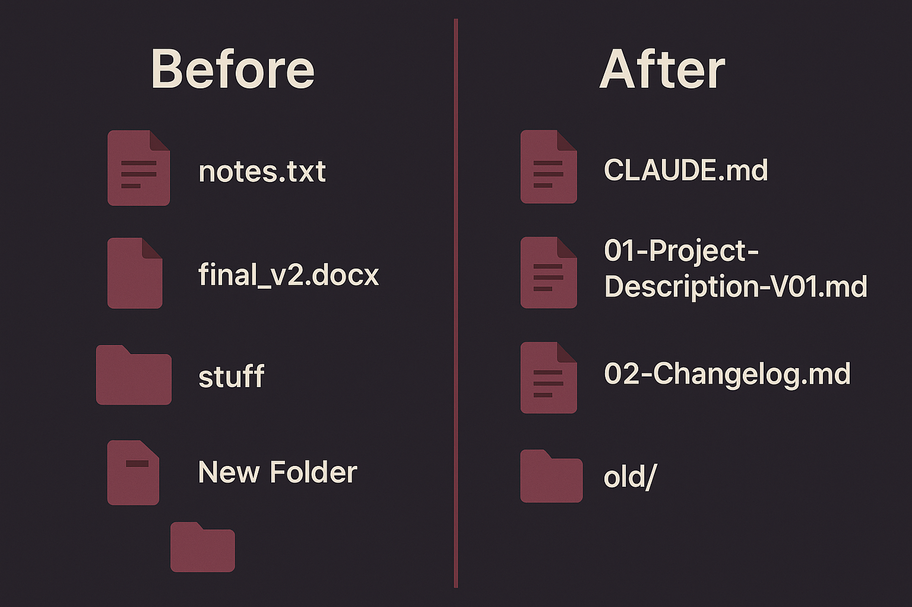
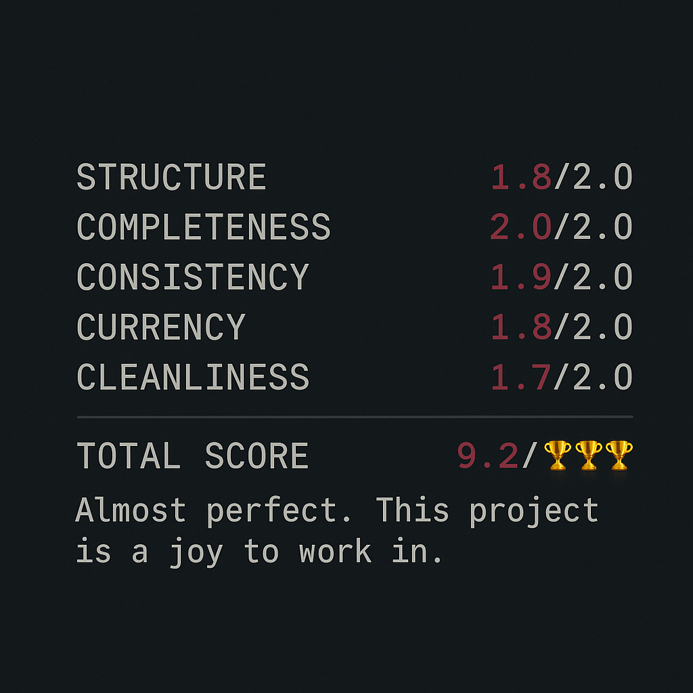

**🇬🇧 English** | [🇩🇪 Deutsch](README.de.md)

<table><tr>
<td width="160"></td>
<td>

# Greg's Business Skills **v1.2.0**

**Like Neo downloading kung fu in The Matrix — except it's business skills. Plug in, download structure, go.**

</td>
</tr></table>

Ever started a new project and spent 20 minutes explaining context to Claude — only to do it all over again next session? Or opened a project folder after two weeks and had zero clue where you left off?

Whether you know the type or you ARE the type: 147 files on the desktop, including "Final_v3_FINAL_really-final-no-seriously-this-time-superfinal.docx". And then you wonder why Claude starts calling you "Hugo"...

Here's the thing: **Claude is only as good as the context you give it.** That's called context engineering — and it's the difference between an AI that calls you "Hugo" and one that knows your project better than you do.

These skills are automated context engineering. You just talk — and Claude turns it into a project structure that still works after weeks and months. Claude stays with you through large projects all the way to the finish line — and only calls people "Hugo" who are actually named Hugo.

---

## Greg's Project Cockpit 🎯

**Start projects right. Keep them right.**

Your first skill bundle. Two skills for structure lovers and excellence seekers:

```
  /project-kickoff              /project-review
  +----------------+            +----------------+
  | START RIGHT    |            | STAY RIGHT     |
  |                |            |                |
  | Structure      | -------->  | Score          |
  | Description    |   Work     | Fix            |
  | Changelog      | <--------  | Polish         |
  | CLAUDE.md      |            | Celebrate      |
  +----------------+            +----------------+
```

**`/project-kickoff`** sets up a clean foundation. **`/project-review`** keeps it clean as the project grows. Without review, every project turns into a jungle. Without a good kickoff, there's nothing worth reviewing.

Install both. Your future self will thank you.

---

## Installation

### 🟢 The Easy Way (always works)

**Step 1:** [📥 Download here](https://github.com/ElevationGroupTECH/gregs-business-skills/archive/refs/heads/main.zip) (one click, download starts immediately)
- Unzip the file

**Step 2:** Tell Claude:
> "Install the skills from ~/Downloads/gregs-business-skills-main/plugins/"

Done. Claude finds the SKILL.md files and puts them where they belong.

**Or copy them manually:**
```
plugins/project-kickoff/skills/project-kickoff/SKILL.md  -->  ~/.claude/commands/project-kickoff.md
plugins/project-review/skills/project-review/SKILL.md    -->  ~/.claude/commands/project-review.md
```

Then restart Claude Code or type `/commands` to verify.

### 🔵 The Auto Way (Claude Code 1.0.33+)

> ⚠️ Requires Claude Code version 1.0.33 or newer.
> Check with: `claude --version` | Update with: `claude update`

```bash
# Register marketplace (one time)
/plugin marketplace add ElevationGroupTECH/gregs-business-skills

# Install
/plugin install project-kickoff@gregs-business-skills     # English
/plugin install project-review@gregs-business-skills      # English
/plugin install projekt-starten@gregs-business-skills     # Deutsch
/plugin install projekt-review@gregs-business-skills      # Deutsch
```

Then just run `/project-kickoff` or `/project-review` in any Claude Code session.

---

## The Skills

### `/project-kickoff` — Start Projects Right

Turn a chaotic brain dump into a properly structured project. You talk, Claude organizes:

- **Project description** with all the details that matter (goals, people, timeline, tech stack)
- **Changelog** with phases, milestones, task tracking, and log entries
- **CLAUDE.md** so Claude knows exactly what to read and how to behave in your project
- **Smart sizing** — small projects stay flat, large ones get letter-prefixed docs + numbered subfolders
- **Assessment columns** — Every task gets assessed: Can Claude handle it alone? What's the impact? Who needs to deliver? How risky? What's the rollback?
- **Verification** — three targeted questions to make sure nothing was lost in translation
- **Perspective shift check** — step out of creator mode, look at your project through your customer's eyes
- **Handoff protocol** — Planned the project in one chat and implementing in another? Bring the handoff protocol — Claude skips questions already answered.

**How it works:** Run `/project-kickoff`, dump everything you know about your project (voice message style is fine — messy, unstructured, all over the place), and watch Claude turn it into a pristine project structure.

### `/project-review` — Polish Check (Score Your Project)

Your project has been growing for weeks. Files everywhere. The changelog is three updates behind. The CLAUDE.md still mentions Phase 1 when you're deep in Phase 3.

This skill runs a comprehensive review and gives you a **Polish Score out of 10**:

| Category | What It Checks |
|---|---|
| 🏗️ **Structure** | CLAUDE.md, file naming, folder hierarchy |
| 📋 **Completeness** | Project description, tasks, milestones, changelog |
| 🔗 **Consistency** | Cross-references, URLs, phase names, status indicators |
| 🕐 **Currency** | Are statuses up to date? Is the changelog current? |
| 🧹 **Cleanliness** | Temp files, orphaned docs, overgrown files |

**What happens:**
1. Full assessment (reads everything, checks everything)
2. Automatic fixes (sort order, log index, file overview — the obvious stuff)
3. Decision table (things that need your input)
4. Recommended tasks with priority and score impact
5. Score forecast: "If you do all of this --> 9.2 / 10"

**The score scale:**
```
0-1: 🤯  |  1-2: 🤬  |  2-3: 😱  |  3-4: 😫  |  4-5: 🥵
5-6: 🧐  |  6-7: 🤔  |  7-8: 😀  |  8-9: 🤩💪  |  9-10: 🏆🏆🏆
```

Hit 9+? You get a celebration. You've earned it.

---

## Examples

<p align="center">
  
</p>

<p align="center">
  
</p>

---

## Who Is This For?

- **Coaches & consultants** managing client projects, course launches, or event planning
- **Marketers** juggling campaigns, content calendars, and website projects
- **Solo entrepreneurs** who need structure but don't have a project manager
- **Anyone using Claude Code** who wants their AI to actually remember what's going on

If you've ever reopened a Claude conversation and spent 10 minutes re-explaining your project — these skills fix that. Permanently.

---

## A Word of Honesty

These skills aren't magic. They won't fix a project that has no clear goal, and they won't replace thinking about what you're actually building. What they will do is remove the friction of setting up and maintaining the boring-but-essential project scaffolding — so you can focus on the work that matters.

They're the skills we use daily. Battle-tested, not perfect. And completely free.

---

## Languages

Every skill is available in **English** and **German**:

| English | Deutsch | Description |
|---|---|---|
| `/project-kickoff` | `/projekt-starten` | Set up a new project with proper structure |
| `/project-review` | `/projekt-review` | Score and polish an existing project |

---

## Contributing

Found a bug? Have an idea for a new skill? PRs and issues are welcome.

---

## License

Apache 2.0 — use it, modify it, share it.

---

## About

Built by **[Teile Deine Botschaft](https://www.teiledeinebotschaft.de)** (TDB). These skills come from Gregor Dorsch — structure nerd, context engineering obsessive, and the kind of person who'd rather spend 2 hours perfecting a CLAUDE.md than 20 minutes working in a messy project.

Structure is king for context engineering. And these skills are Greg's way of automating that for everyone.

> *Built from hundreds of hours of real project work with Claude. Not theory — this is how we actually work every day.*

**Want to go deeper?**
- [Visit our website](https://www.teiledeinebotschaft.de) — Online business without tech headaches
- [Meet the team](https://www.teiledeinebotschaft.de/termin) — Book a free intro call
- [Read what our clients say](https://www.teiledeinebotschaft.de/kundenstimmen) — Real voices, real results

---

*Powered by Teile Deine Botschaft • Elevation Group G.N.D LTD*
